# 🧠 Agents Service

The **Agents Service** is the intelligence core of the **EmbedAI Learn** platform. It exposes a FastAPI interface that allows the frontend/backend to interact with various specialized AI agents, capable of understanding project requirements, generating code, troubleshooting issues, and planning wiring connections.

---

## 🏗️ Architecture

The service is built using **FastAPI** and follows a modular architecture where specific "runners" or "agents" handle distinct tasks.

```mermaid
graph TD
    Client[Frontend / Backend] -->|HTTP POST| API[FastAPI Router]
    
    subgraph "Endpoint Routing"
        API -->|/project-name| NameAgent[📛 Name Agent]
        API -->|/main-agent| MainSeq[Main Sequence]
        API -->|/code-agent| CodeAgent[💻 Code Agent]
        API -->|/qa-agent| QAAgent[🔧 QA/Troubleshoot Agent]
        API -->|/basic-modules| BasicAgent[📚 Beginner Modules]
        API -->|/compile| Compiler[⚡ Arduino CLI]
    end

    subgraph "Agent Logic"
        MainSeq -->|Step 1| Desc[📝 Description Agent]
        MainSeq -->|Step 2| Wiring[🔌 Wiring Agent]
        
        NameAgent <-->|Search| VectorDB[(FAISS DB)]
        Desc <-->|Generate| LLM[Gemini / OpenAI]
        Wiring <-->|Plan| LLM
        CodeAgent <-->|Code| LLM
        QAAgent <-->|Context & Chat| LLM
        QAAgent <-->|Retrieve| VectorDB
    end

    Compiler -->|Verify| Sketch[📂 .ino File]
    Compiler -->|Upload| Board[📟 ESP32 / Arduino]
```



---

## 🤖 Specialized Agents

| Agent Name | Function | Endpoint |
| :--- | :--- | :--- |
| **Name Agent** | Identifies the project intent from a vague user description using vector search against a database of known projects. | `/project-name` |
| **Description Agent** | Generates a high-level project briefing, explaining *what* the project is and *why* it's useful. | `/main-agent` |
| **Wiring Agent** | Creates a step-by-step wiring guide, listing components and pin connections. | `/main-agent` |
| **Code Agent** | Generates the complete C++/Arduino code for the project, ready for compilation. | `/code-agent` |
| **Troubleshoot (QA) Agent** | A conversational agent that helps users debug hardware/software issues by maintaining context of the current project. | `/qa-agent` |
| **Beginner Agent** | Delivers structured learning modules (Basics & Adaptive) for newcomers. | `/basic-modules`, `/adaptive-modules` |

---

## 🛠️ System Tools

### ⚡ Compilation & Uploading
The service integrates directly with **Arduino CLI** to validate and flash code.
1. **Code Extraction**: The `Code Agent` saves generated code to a temporary `.ino` file.
2. **Compilation**: The `/compile` endpoint triggers `arduino-cli compile`, returning success/error logs.
3. **Flashing**: The `/upload` endpoint triggers `arduino-cli upload` to flash the binary to a connected device.

### 🗄️ Vector Database (RAG)
We use **FAISS (Facebook AI Similarity Search)** to store embeddings of project knowledge.
- Allows the **Name Agent** to map "I want a thing that beeps when I move" to "Motion Detector Alarm".
- Allows the **QA Agent** to retrieve relevant documentation when helping a user.

---

## 🚀 Setup & Usage

### 1. Environment Variables
Ensure your `.env` file in this directory contains:
```env
GOOGLE_API_KEY=...    # For Gemini Models
OPENAI_API_KEY=...    # Optional / Backup
```

### 2. Installation
```bash
python -m venv venv
source venv/bin/activate
pip install -r requirements.txt
```

### 3. Run Server
```bash
python run_server.py
```
The server will start at `http://0.0.0.0:8000`.

### 4. API Docs
Visit `http://localhost:8000/docs` for the interactive Swagger UI to test endpoints directly.
