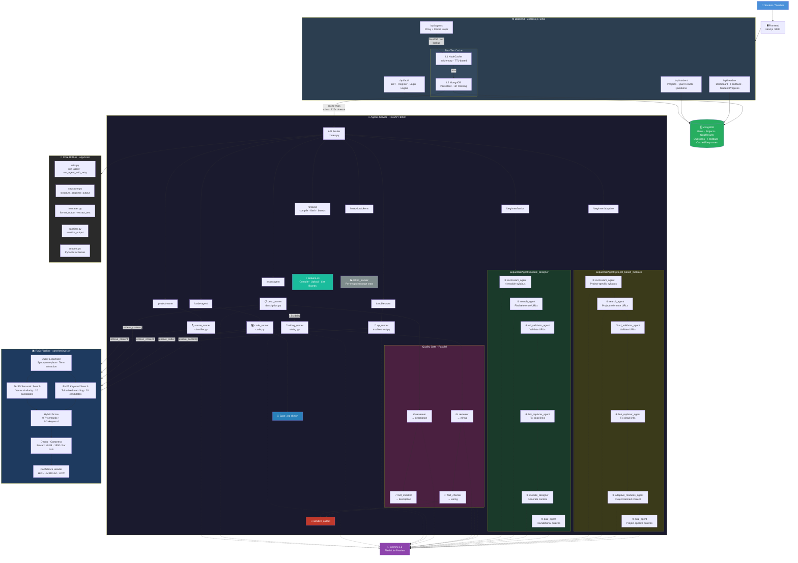

# EmbedAI Learn — Complete Architecture Flowchart

## How to render

Copy the Mermaid block below and paste into https://mermaid.live to render.

```mermaid
flowchart TD
    %% ===== FRONTEND =====
    USER["👤 Student / Teacher"] --> UI["🖥️ Frontend\nNext.js :3000"]

    %% ===== BACKEND =====
    UI --> BACKEND

    subgraph BACKEND["⚙️ Backend · Express.js :5001"]
        direction TB
        AUTH["/api/auth\nJWT · Register · Login · Logout"]
        STUDENT_API["/api/student\nProjects · Quiz Results · Questions"]
        TEACHER_API["/api/teacher\nDashboard · Feedback · Student Progress"]
        AGENT_PROXY["/api/agents\nProxy + Cache Layer"]

        subgraph CACHE["Two-Tier Cache"]
            L1["L1 NodeCache\nIn-Memory · TTL-based"]
            L2["L2 MongoDB\nPersistent · Hit Tracking"]
        end

        AGENT_PROXY -->|"SHA256 hash\nlookup"| L1
        L1 -->|miss| L2
    end

    AUTH --> DB
    STUDENT_API --> DB
    TEACHER_API --> DB
    L2 --> DB

    DB[("🗄️ MongoDB\nUsers · Projects · QuizResults\nQuestions · Feedback · CachedResponses")]

    %% ===== CACHE MISS → AGENTS =====
    L2 -->|"cache miss\naxios · 120s timeout"| ROUTER

    %% ===== AGENTS SERVICE =====
    subgraph AGENTS["🤖 Agents Service · FastAPI :8000"]
        direction TB
        ROUTER["API Router\nroutes.py"]

        ROUTER --> EP_NAME["/project-name"]
        ROUTER --> EP_MAIN["/main-agent"]
        ROUTER --> EP_CODE["/code-agent"]
        ROUTER --> EP_BASICS["/beginner/basics"]
        ROUTER --> EP_ADAPTIVE["/beginner/adaptive"]
        ROUTER --> EP_TROUBLE["/troubleshoot"]
        ROUTER --> EP_ARDUINO["/arduino\ncompile · flash · boards"]
        ROUTER --> EP_ANALYTICS["/analytics/tokens"]

        %% --- /project-name ---
        EP_NAME --> NAME_RUNNER["🏷️ name_runner\nclassifier.py"]

        %% --- /main-agent (core pipeline) ---
        EP_MAIN --> DESC_RUNNER["📋 desc_runner\ndescription.py"]
        DESC_RUNNER -->|"1.5s delay"| WIRING_RUNNER["🔌 wiring_runner\nwiring.py"]

        DESC_RUNNER --> REV_D["✏️ reviewer\n→ description"]
        WIRING_RUNNER --> REV_W["✏️ reviewer\n→ wiring"]

        subgraph QUALITY["Quality Gate · Parallel"]
            REV_D --> FC_D["✅ fact_checker\n→ description"]
            REV_W --> FC_W["✅ fact_checker\n→ wiring"]
        end

        FC_D --> SANITIZE["🧹 sanitize_output"]
        FC_W --> SANITIZE

        %% --- /code-agent ---
        EP_CODE --> CODE_RUNNER["💻 code_runner\ncode.py"]
        CODE_RUNNER --> INO["💾 Save .ino sketch"]

        %% --- /beginner/basics ---
        EP_BASICS --> BASICS_SEQ

        subgraph BASICS_SEQ["SequentialAgent: module_designer"]
            direction TB
            B1["① curriculum_agent\n4-module syllabus"] --> B2["② search_agent\nFind reference URLs"]
            B2 --> B3["③ url_validator_agent\nValidate URLs"]
            B3 --> B4["④ link_replacer_agent\nFix dead links"]
            B4 --> B5["⑤ module_designer\nGenerate content"]
            B5 --> B6["⑥ quiz_agent\nFoundational quizzes"]
        end

        %% --- /beginner/adaptive ---
        EP_ADAPTIVE --> ADAPTIVE_SEQ

        subgraph ADAPTIVE_SEQ["SequentialAgent: project_based_modules"]
            direction TB
            C1["① curriculum_agent\nProject-specific syllabus"] --> C2["② search_agent\nProject reference URLs"]
            C2 --> C3["③ url_validator_agent\nValidate URLs"]
            C3 --> C4["④ link_replacer_agent\nFix dead links"]
            C4 --> C5["⑤ adaptive_modules_agent\nProject-tailored content"]
            C5 --> C6["⑥ quiz_agent\nProject-specific quizzes"]
        end

        %% --- /troubleshoot ---
        EP_TROUBLE --> QA_RUNNER["🔧 qa_runner\ntroubleshoot.py"]

        %% --- Arduino CLI ---
        EP_ARDUINO --> ARDUINO_CLI["⚡ arduino-cli\nCompile · Upload · List Boards"]

        %% --- Analytics ---
        EP_ANALYTICS --> TRACKER["📊 token_tracker\nPer-endpoint usage stats"]
    end

    %% ===== RAG RETRIEVAL =====
    subgraph RAG["📚 RAG Pipeline · core/retriever.py"]
        direction TB
        EXPAND["Query Expansion\nSynonym replace · Term extraction"]
        EXPAND --> FAISS["FAISS Semantic Search\nVector similarity · 20 candidates"]
        EXPAND --> BM25["BM25 Keyword Search\nTokenized matching · 20 candidates"]
        FAISS --> HYBRID["Hybrid Score\n0.7×semantic + 0.3×keyword"]
        BM25 --> HYBRID
        HYBRID --> DEDUP["Dedup · Compress\nJaccard ≥0.85 · 1500 char limit"]
        DEDUP --> CONFIDENCE["Confidence Header\nHIGH · MEDIUM · LOW"]
    end

    NAME_RUNNER -->|"retrieve_content()"| RAG
    DESC_RUNNER -->|"retrieve_content()"| RAG
    WIRING_RUNNER -->|"retrieve_content()"| RAG
    CODE_RUNNER -->|"retrieve_code()"| RAG
    QA_RUNNER -->|"retrieve_content()"| RAG

    %% ===== LLM =====
    LLM["🧠 Gemini 3.1\nFlash Lite Preview"]

    NAME_RUNNER -.-> LLM
    DESC_RUNNER -.-> LLM
    WIRING_RUNNER -.-> LLM
    CODE_RUNNER -.-> LLM
    QA_RUNNER -.-> LLM
    REV_D -.-> LLM
    REV_W -.-> LLM
    FC_D -.-> LLM
    FC_W -.-> LLM
    B1 -.-> LLM
    B2 -.-> LLM
    B5 -.-> LLM
    B6 -.-> LLM
    C1 -.-> LLM
    C2 -.-> LLM
    C5 -.-> LLM
    C6 -.-> LLM

    %% ===== CORE UTILITIES =====
    subgraph CORE["🔧 Core Utilities · app/core/"]
        UTILS["utils.py\nrun_agent · run_agent_with_retry"]
        STRUCT["structurer.py\nstructure_beginner_output"]
        FORMAT["formatter.py\nformat_output · extract_text"]
        SANIT_UTIL["sanitizer.py\nsanitize_output"]
        MODELS["models.py\nPydantic schemas"]
    end

    ROUTER --> CORE

    %% ===== STYLES =====
    style USER fill:#4a90d9,color:white
    style BACKEND fill:#2c3e50,color:white
    style AGENTS fill:#1a1a2e,color:white
    style RAG fill:#1e3a5f,color:white
    style CACHE fill:#34495e,color:white
    style QUALITY fill:#4a2040,color:white
    style BASICS_SEQ fill:#1a3a2a,color:white
    style ADAPTIVE_SEQ fill:#3a3a1a,color:white
    style CORE fill:#2a2a2a,color:white
    style LLM fill:#8e44ad,color:white
    style DB fill:#27ae60,color:white
    style SANITIZE fill:#c0392b,color:white
    style INO fill:#2980b9,color:white
    style ARDUINO_CLI fill:#1abc9c,color:white
    style TRACKER fill:#7f8c8d,color:white
```
