# ⚙️ Backend Service

The **Backend Service** serves as the user-facing API and orchestration layer for **EmbedAI Learn**. Built with **Node.js** and **Express**, it handles authentication, state management, and acts as a smart caching proxy for the AI Agents service.

---

## 🏗️ Architecture

```mermaid
graph TD
    Client[Frontend] -->|HTTP Requests| Server[Express Server]
    
    subgraph "Middleware Layer"
        Server --> Auth[🔐 Auth Middleware]
        Server --> Cache[🛡️ Cache Shield]
    end
    
    subgraph "Data Persistence"
        Auth <-->|Verify/Sign| JWT[JWT Token]
        Cache <-->|Read/Write| MongoDB[(MongoDB Atlas/Local)]
    end
    
    subgraph "External Services"
        Cache -->|Cache MISS| Agents[🧠 Python Agents API]
        Agents -->|Response| Cache
    end
```



### Key Components

1.  **Auth Middleware**: 
    - Validates **JWT** tokens for protected routes.
    - Manages user sessions and permissions.

2.  **Cache Shield (The "Shield")**: 
    - Intercepts requests to the expensive AI Agents.
    - **Normalization**: Cleans inputs (e.g., trims whitespace, lowercase) to ensure "Create a robot" and "create a robot" hit the same cache key.
    - **Atomic Caching**: Uses `findOneAndUpdate` with `upsert` to prevent race conditions when multiple users request the same popular project simultaneously.
    - **Cost Saving**: Significantly reduces bills by serving cached LLM responses for common queries.

3.  **Database (MongoDB)**:
    - Stores `Users`, `Projects`, and `CachedResponse` data.

---

## 🔌 API Endpoints

### 🔐 Authentication (`/api/auth`)
| Method | Endpoint | Description |
| :--- | :--- | :--- |
| `POST` | `/register` | Register a new user. |
| `POST` | `/login` | Authenticate and receive a JWT. |
| `GET` | `/user` | Get current user details (Protected). |

### 🤖 Agents Proxy (`/api/agents`)
*All agent routes are proxied to the Python service after checking the cache.*

| Method | Endpoint | Description |
| :--- | :--- | :--- |
| `POST` | `/project-name` | Identifies project intent from description. |
| `POST` | `/main-agent` | Generates description and wiring guide. |
| `POST` | `/code-agent` | Generates C++/Arduino code. |
| `POST` | `/qa-agent` | Chat with the troubleshooting assistant. |
| `POST` | `/compile` | Triggers remote composition via Arduino CLI. |

---

## 🚀 Setup & Usage

### 1. Prerequisites
- **Node.js** v18+
- **MongoDB** running locally or via Atlas.

### 2. Environment Variables
Create a `.env` file in this directory:
```env
PORT=5000
MONGO_URI=mongodb://localhost:27017/embedai
JWT_SECRET=your_super_secret_key
AGENTS_API_URL=http://localhost:8000
```

### 3. Installation
```bash
npm install
```

### 4. Run Server
```bash
# Development (with nodemon)
npm run dev

# Production
npm start
```
The server will start on `http://localhost:5000`.
