# 🎨 Frontend Application

The **Frontend Application** is the user interface of **EmbedAI Learn**, built with **Next.js 14**, **TypeScript**, and **Tailwind CSS**. It provides a premium, interactive experience for students to design, simulate, and troubleshoot embedded systems projects.

---

## 🏗️ Architecture

```mermaid
graph TD
    User([👤 User]) -->|Visits| Home[🏠 Landing Page]
    User -->|Enters Idea| Project[🛠️ Project Dashboard]

    subgraph "Project Dashboard (/project/[id])"
        Project --> Overview[📋 Overview & Roadmap]
        Project --> Modules[📚 Learning Modules]
        Project --> Agents[🤖 AI Agents]
        
        subgraph "AI Agents"
            Agents --> Wiring[🔌 Wiring Guide]
            Agents --> Code[💻 Code Generator]
            Agents --> QA[🔧 Troubleshoot Chat]
        end
        
        subgraph "Hardware Interaction"
            Code -->|Compile/Flash| ArduinoCLI[⚡ Arduino CLI]
        end
    end

    subgraph "Data & State"
        Home <-->|Fetch| API[📡 Backend API]
        Project <-->|Stream| API
        API <-->|Auth| Auth[🔐 JWT Auth]
    end
```



---

## 🧩 Key Components

### 1. **Project Dashboard (`app/project/[id]`)**
The core interface where learning happens. It dynamically loads:
- **`ProjectOverview`**: Displays the AI-generated project briefing and roadmap.
- **`ModuleViewer`**: A step-by-step interactive lesson viewer with rich markdown rendering.
- **`WiringAgent`**: Visualizes component connections.
- **`CodeAgent`**: Generates and displays C++/Arduino code with syntax highlighting.
- **`TroubleshootAgent`**: A context-aware chat interface for debugging.

### 2. **UI Library (`components/ui`)**
A comprehensive set of reusable components built with **Radix UI** primitives and styled with **Tailwind CSS**.
- **Design System**: Glassmorphism effects, dark mode 'void' theme, and fluid animations.
- **Key Components**: `Card`, `Button`, `Dialog`, `ScrollArea`, `Tabs`, `Toast`.

### 3. **Markdown Renderer (`components/markdown-renderer.tsx`)**
A custom robust renderer that supports:
- **Syntax Highlighting**: Using `react-syntax-highlighter` (VS Code Dark Plus theme).
- **GFM**: GitHub Flavored Markdown support via `remark-gfm` (tables, strikethrough).
- **Styling**: Tailwind typography plugin integration for beautiful prose.

---

## 🛠️ Tech Stack

- **Framework**: [Next.js 14](https://nextjs.org/) (App Router)
- **Language**: [TypeScript](https://www.typescriptlang.org/)
- **Styling**: [Tailwind CSS](https://tailwindcss.com/)
- **Animation**: [Framer Motion](https://www.framer.com/motion/)
- **Icons**: [Lucide React](https://lucide.dev/)
- **State Management**: React Hooks (`useState`, `useEffect`, Custom Hooks)

---

## 🚀 Setup & Usage

### 1. Prerequisites
- **Node.js** v18+
- **npm** or **yarn**

### 2. Environment Variables
Create a `.env.local` file in this directory:
```env
NEXT_PUBLIC_API_URL=http://localhost:5000/api/agents
```

### 3. Installation
```bash
npm install
```

### 4. Run Development Server
```bash
npm run dev
```
Open [http://localhost:3000](http://localhost:3000) with your browser.

### 5. Build for Production
```bash
npm run build
npm start
```

---

## 📁 Folder Structure

| Path | Description |
| :--- | :--- |
| `/app` | Next.js App Router pages and layouts. |
| `/components` | React components (Agents, UI, Shared). |
| `/components/ui` | Reusable atomic UI elements (Shadcn UI). |
| `/hooks` | Custom hooks (e.g., `use-toast`, `use-mobile`). |
| `/lib` | Utility functions and API clients. |
| `/public` | Static assets (images, icons). |
